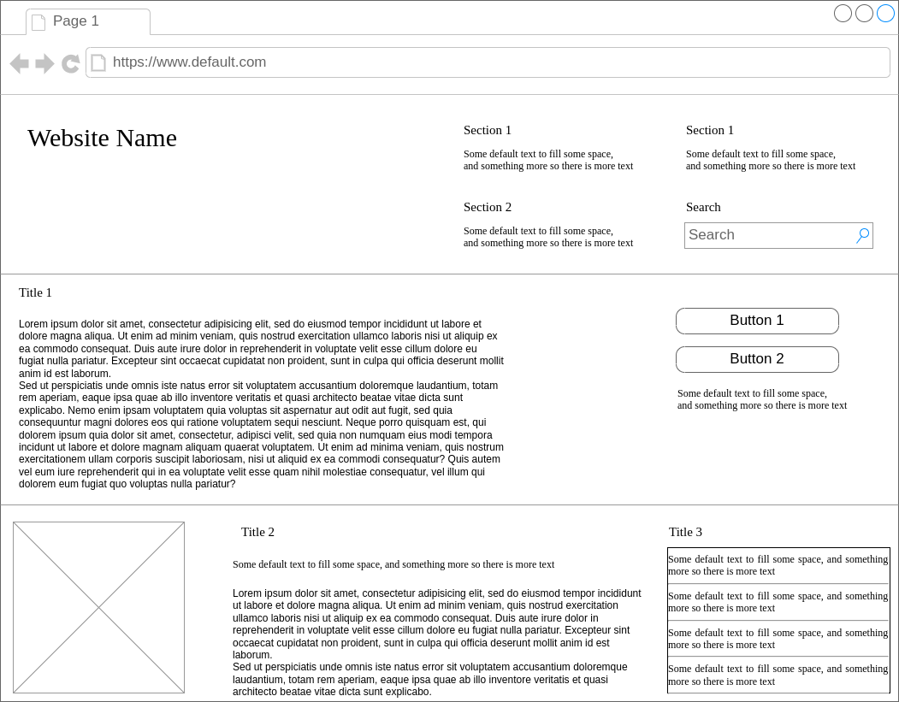

# Ejercicio 01

## Paso 1. Usando el template de ReactJS crear un proyecto React

Template: https://github.com/ElDwarf/React-project-vs-template

## Paso 2. Replicar el wireframe que se adjunta a continuacion usando completamente componentes de React

## Paso 3. Crear repositorio y subir el codigo.

## Paso 4. Cargar PR con el codigo e invitarme para revisarlo
